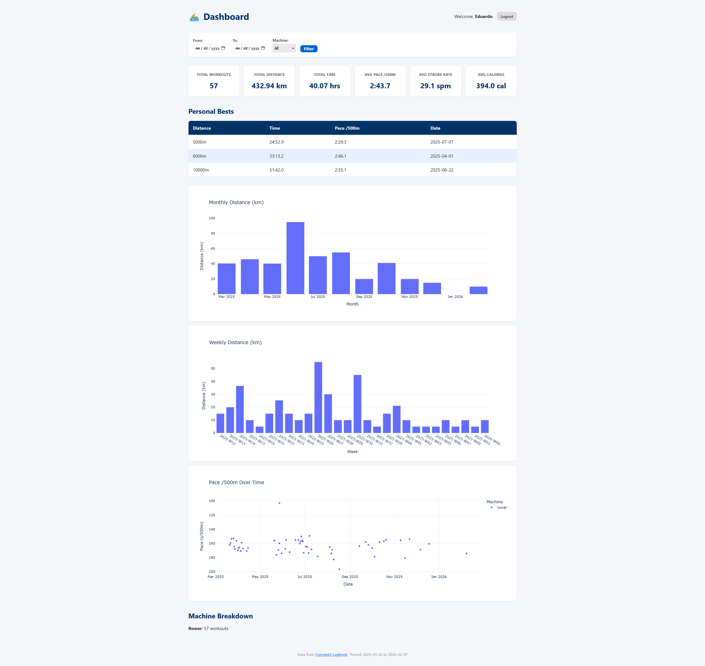

# 🚣 Rowing App — Concept2 Analytics Dashboard

A personal analytics dashboard that connects to the **Concept2 Logbook API** to visualise your rowing workout data with interactive charts, trend analysis, and machine learning insights.

Built with **FastAPI**, **Plotly**, and **scikit-learn**.



---

## ✨ Features

| Category | Details |
|---|---|
| **OAuth2 Login** | Secure authentication with the Concept2 Logbook |
| **Interactive Dashboard** | Monthly/weekly distance charts, pace trend with gradient colouring |
| **GitHub-style Heatmap** | Training calendar showing daily rowing volume |
| **Pace Trend Regression** | Linear regression + rolling average with R² score |
| **Workout Clustering** | K-Means clustering to identify training patterns (endurance, sprint, steady-state) |
| **Personal Bests** | Auto-detected PBs across standard distances |
| **CSV Export** | One-click download of all workout data |
| **Docker Ready** | Containerised deployment with Docker Compose |

---

## 🛠️ Tech Stack

- **Backend:** Python 3.11, FastAPI, Uvicorn
- **Auth:** OAuth2 Authorization Code flow via Authlib
- **Data:** Pandas, NumPy
- **Visualisation:** Plotly (Graph Objects + Express)
- **Machine Learning:** scikit-learn (KMeans, LinearRegression, StandardScaler)
- **Templating:** Jinja2 + custom CSS
- **HTTP Client:** httpx (async)
- **Containerisation:** Docker, Docker Compose

---

## 📁 Project Structure

```
rowing_app/
├── main.py            # FastAPI app & routes
├── config.py          # Pydantic settings (loads .env)
├── auth.py            # OAuth2 flow with Concept2
├── api_client.py      # Concept2 API wrapper (with retries)
├── analytics.py       # Statistics, regression, clustering, heatmap
├── models.py          # Pydantic data models
├── templates/
│   ├── home.html      # Landing page
│   └── dashboard.html # Analytics dashboard
└── static/
    └── style.css      # Custom styles

rowing_app.ipynb       # Tutorial notebook (heatmap, regression, clustering)
Dockerfile
docker-compose.yml
requirements.txt
```

---

## 🚀 Getting Started

### Prerequisites

- Python 3.11+
- A [Concept2 Logbook](https://log.concept2.com) account
- A registered Concept2 API application ([register here](https://log.concept2.com/developers/register))

### 1. Clone the repository

```bash
git clone https://github.com/eduardocabrera1983/rowing-app.git
cd rowing-app
```

### 2. Create a virtual environment

```bash
python -m venv .venv

# Windows
.venv\Scripts\activate

# macOS/Linux
source .venv/bin/activate
```

### 3. Install dependencies

```bash
pip install -r requirements.txt
```

### 4. Configure environment variables

Create a `.env` file in the project root:

```env
C2_CLIENT_ID=your_client_id
C2_CLIENT_SECRET=your_client_secret
C2_REDIRECT_URI=http://localhost:8000/auth/callback
C2_SCOPE=user:read,results:read
APP_SECRET_KEY=a-random-secret-string
```

> **Note:** You get the Client ID and Secret when you register your app at [log.concept2.com/developers](https://log.concept2.com/developers/register). Set the redirect URI to `http://localhost:8000/auth/callback`.

### 5. Run the app

```bash
uvicorn rowing_app.main:app --reload
```

Open **http://localhost:8000** in your browser, click **Connect**, and authorise with your Concept2 account.

---

## 🐳 Docker

```bash
# Build and run
docker compose up --build

# Or detached
docker compose up --build -d
```

The app will be available at **http://localhost:8000**.

---

## 📊 API Endpoints

| Method | Endpoint | Description |
|---|---|---|
| `GET` | `/` | Landing page |
| `GET` | `/auth/login` | Start OAuth2 flow |
| `GET` | `/auth/callback` | OAuth2 callback |
| `GET` | `/auth/logout` | Clear session |
| `GET` | `/dashboard` | Analytics dashboard |
| `GET` | `/export/csv` | Download workouts as CSV |
| `GET` | `/api/results` | Raw workout results (JSON) |
| `GET` | `/api/summary` | Summary statistics (JSON) |

---

## 📓 Tutorial Notebook

The included `rowing_app.ipynb` Jupyter notebook walks through the data science techniques used in the dashboard:

1. **Training Heatmap** — Building a GitHub-style activity calendar
2. **Pace Trend Regression** — Linear regression and rolling averages
3. **Workout Clustering** — K-Means to identify training patterns

Each section includes detailed explanations of **what**, **why**, and **how**.

---

## 📝 License

This project is for personal/educational use. The Concept2 Logbook API is subject to [Concept2's terms of service](https://www.concept2.com/legal/terms-of-use).

---

## 🤝 Acknowledgements

- [Concept2](https://www.concept2.com/) for the Logbook API
- [Plotly](https://plotly.com/) for interactive visualisations
- [FastAPI](https://fastapi.tiangolo.com/) for the web framework
- [scikit-learn](https://scikit-learn.org/) for machine learning tools
